## 🐱‍🐉 동방역검; 동방Eㅔ 신기한 역량검사🧠

---

**`링크:www.dongbangyuk.com`**

---

## 0. 프로젝트 진행기간

---

2023.04.10(월) ~ 2023.05.19(금)

---

## 1. 기획 배경

---

- 점점 어려워지는 취업시장, 이제는 기계의 평가를 통과해야하는 시대입니다.

- 면접 전 AI 역량검사를 시행하는 기업은 현재 1000개 이상이며, 얼마 전 '개발자용 AI역검'이 출시되어 대비의 필요성이 커지고 있습니다.

- AI역검 개발사는 자연스러운 본인의 모습으로 역량을 판단하기에 연습을 하면 좋은 결과를 얻을 수 있다고 하지만, 지원자를 위한 서비스는 존재하지 않으며, 역검 사이트에서 연습을 하더라도 정확한 나의 결과를 확인하기 어렵습니다😐

- 동방역검은 AI 역량검사 지원자를 위해 탄생한 서비스입니다.

- 대비가 어려운 AI역검 전략게임을 언제 어디서나 쉽게 연습하고, 수치화된 나의 게임 점수와 녹화영상 분석결과를 확인해보세요!

---

## 2. 주요기능

---

#### 🎮 전략게임 연습

###### 개발자용 AI역검에서 시행하는 네가지 전략게임에 대한 평가역량, 플레이 방법을 확인하고 동일한 환경에서 연습해보세요!

##### 1. 가위바위보✌✊🖐

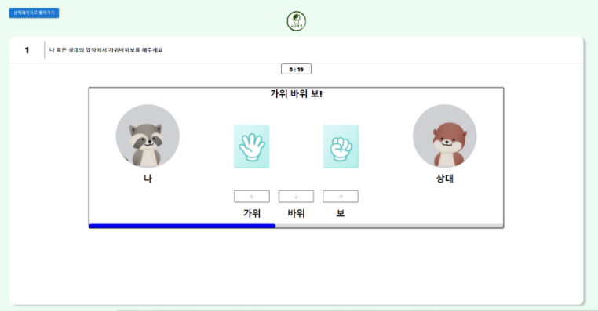

- **'인지능력'** 평가를 위한 게임입니다. 

- 내가 승리할 수 있도록 라운드별 규칙에 따라 내야하는 패를 골라보세요!

##### 2. 길 만들기🖇

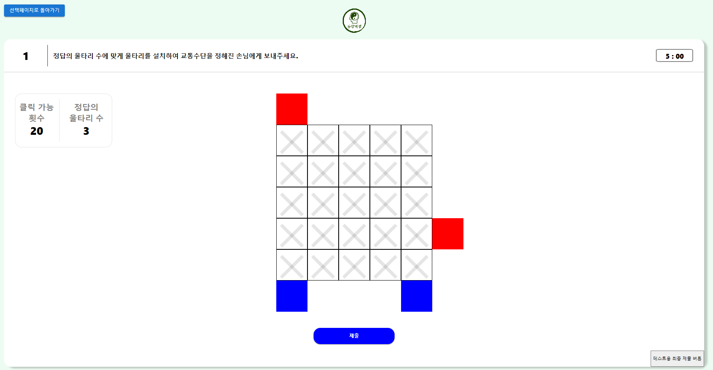

- **'계획능력'** 평가를 위한 게임입니다.

- 주어진 좌표들 중 올바른 곳에 정해진 개수만큼의 사다리를 놓아 운반수단이 일치하는 칸에 도착하도록 도와주세요!

##### 3. 고양이 술래잡기😺 vs 🐭

| 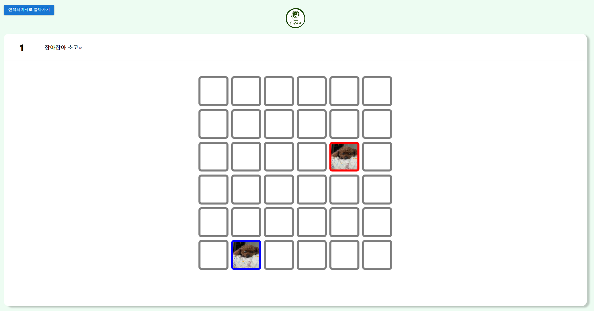 | 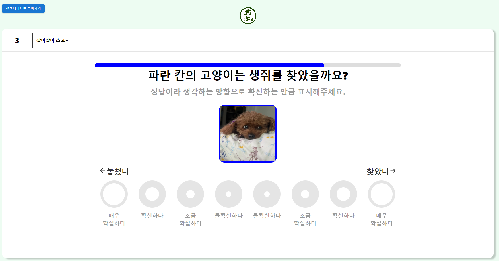 | 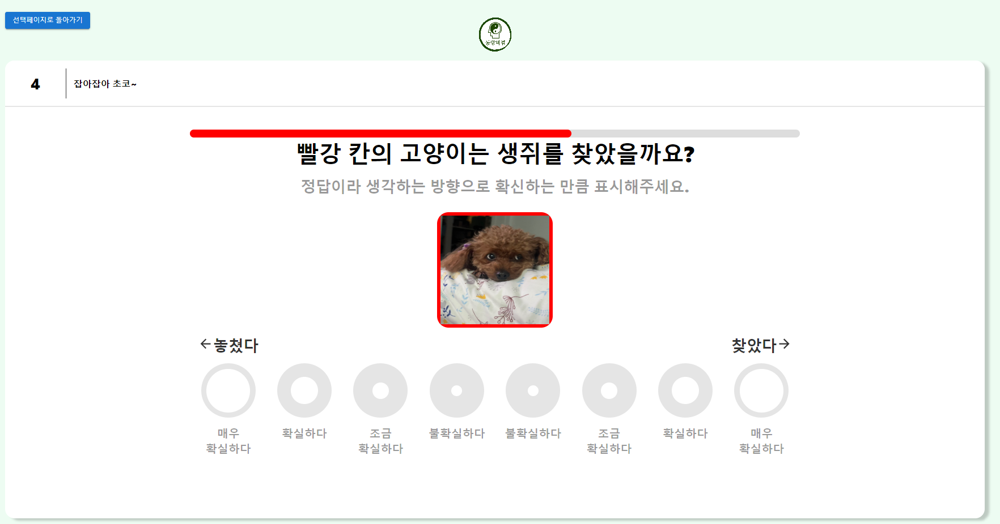 |
| :----------------------------------------------------------: | :----------------------------------------------------------: | :----------------------------------------------------------: |

- **'작업기억'** 평가를 위한 게임입니다.

- 고양이와 생쥐가 나타난 공간을 기억해서 주어진 두 칸에서 고양이가 쥐를 잡는데 성공했는지 선택해주세요.

##### 4. 도형 회전하기📐

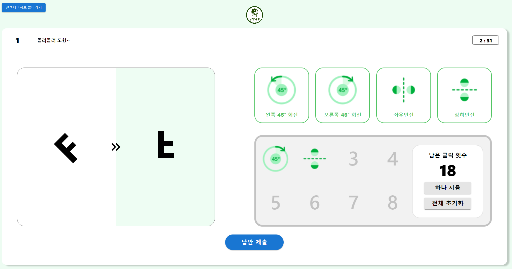

- **'공간능력'** 평가를 위한 게임입니다.

- 주어진 횟수 안에 도형을 최소한으로 움직여서 목표 도형과 일치한 모양으로 만들어 주세요!

---

#### 🖍 세부통계

###### 플레이한 게임별 채점 결과와 영상 분석 결과를 확인해보세요.

###### 1. 채점결과

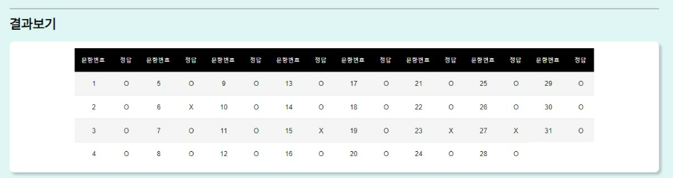

- 연습한 게임의 푼 문제수, 각 문제별 정답여부를 확인할 수 있습니다.
  
  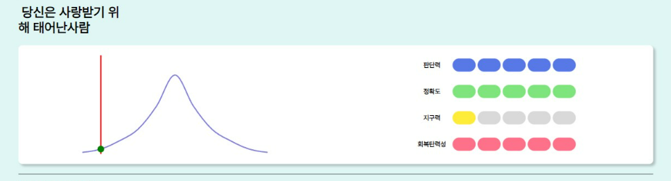

- 연습한 게임의 전체 결과 대비 나의 점수와 위치를 확인할 수 있습니다.

- 알고리즘과 정밀채점을 통해 산출된 다섯가지 역량 점수를 확인해보세요.
  
  - 역량 판단 기준
    
    | **판단력**  | 문제별 풀이시간으로 순간 판단력을 측정합니다. 미응답 문제수와 정답률도 함께 평가합니다. |
    | :---------: | ------------------------------------------------------------ |
    |   정확도    | 풀이한 문제들의 정답률로 측정합니다.                         |
    |   안정성    | 게임 수행중 얼굴이 잘 인식되게 응시하였는지 판단합니다.      |
    |   지구력    | 게임 수행 시간에 따른 정답률 변화를 비교하여 집중도와 지구력을 판단합니다. 시간에 따라 점진적으로 감소할 경우 개선이 필요합니다. |
    | 회복 탄력성 | AI얼굴인식을 바탕으로 감정기복 발생 시점 기준 정답률 변화를 판단합니다. 위기상황에 대한 대처능력을 평가하는 요소입니다. |

###### 2. AI 영상분석

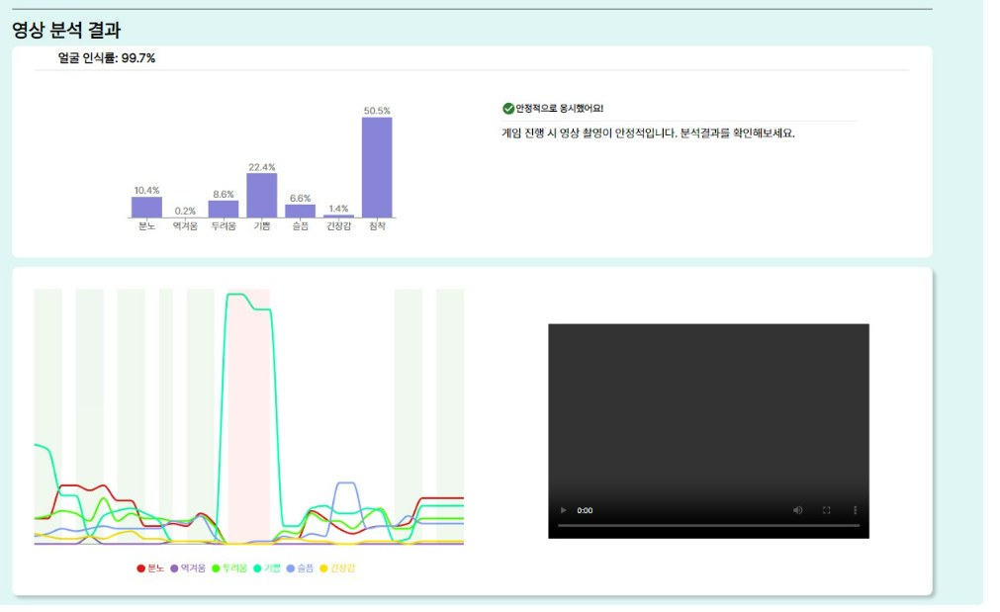

- 공식사이트에서 사용하는 OpenCV 라이브러리를 사용하여 응시중 사용자의 감정 변화를 그래프로 보여줍니다.

- 문제풀이 시간을 기준으로 이동하며 나의 영상을 확인하고 피드백할 수 있습니다.

- 급격한 감정변화 시점을 클릭하여 개선점을 찾아보세요.

---

#### 📊 종합분석

###### 네가지 전략게임을 완료하면 최신 게임결과를 기반으로 종합 역량을 제공합니다.

- 종합역량
  
  |  |  |
  | ---------------------------------------------------------------------------------------------------------------- | ---------------------------------------------------------------------------------------------------------------- |
  
  - 분석에 사용된 각 게임별 최신 결과에 대한 나의 위치를 확인하여 어떤 역량을 보완해야하는지 확인할 수 있습니다.
  - 네가지 게임 결과를 기반으로 분석된 나의 종합 역량을 확인할 수 있습니다.

---

#### 나의 운세 확인🎆🎰🃏🀄

###### 모호한 기준의 AI역검을 돌파할 수 있는 자신감을 키워주는 기능

##### 1. 오늘의 운세

|  | 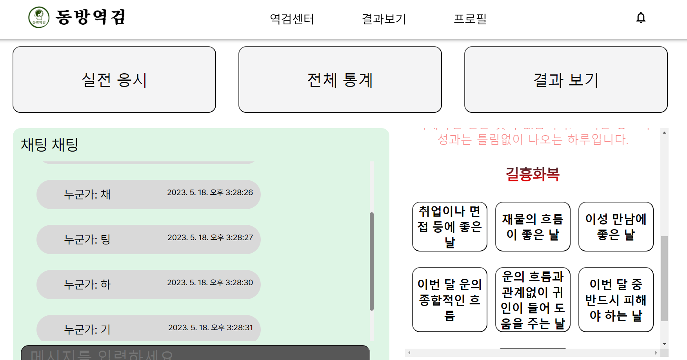 |
| :----------------------------------------------------------: | :----------------------------------------------------------: |

- 타고난 나의 기질과 사주팔자를 기반으로 한 오늘의 운세와 길흉화복을 확인

- 메타인지와 길일 확인으로 자신감 상승

---

#### 🎸기타기능

##### 기타기타야..

###### 🔔분석완료 알림기능

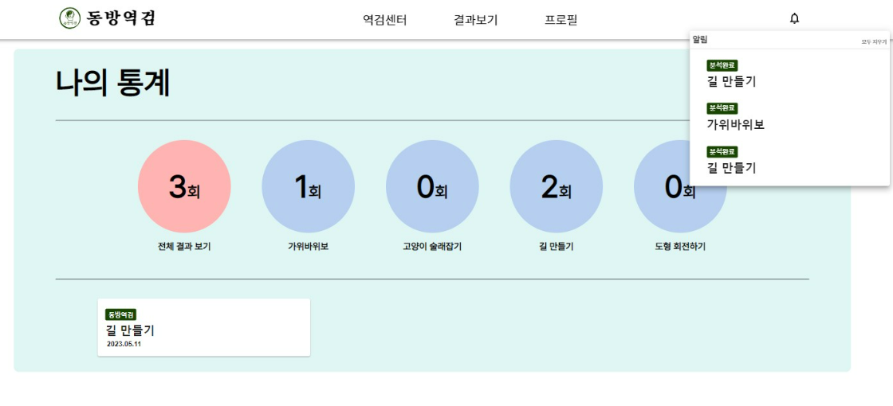

- 영상 분석 & 채점 완료시 알림 발송

###### 📢카카오톡 플러스친구

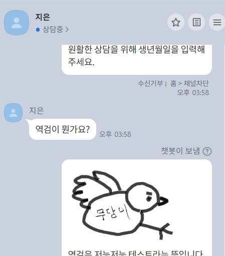

- VOC 실시간 반영을 위한 카카오톡 플러스 친구 운영

- 버그 발견시 행운의 쿠폰 제공

---

## 3. 기술적 특징 & 아키텍쳐

## 

##### - HOC 패턴 렌더링

    - 컴포넌트 재사용성, 프론트 코드 최적화

##### - WebRTC 사용

    - Kurento 도입하여 영상을 실시간으로 전송하여 서버 과부하 방지

##### - 알고리즘 활용한 문제생성 & 정밀채점

    - 문제 생성 & 채점 알고리즘으로 양질의 문제 제공

##### - OpenCV 활용 AI영상 분석

    - 미세표정 분석하여 정밀 분석 데이터 제공

##### - Kafka 도입 및 BFF

    - Backend 데이터 flow 최적화

##### - MSA&무중단배포&영상 분산처리

    - 인프라 최적화

---

## 4. 팀원소개

- 임소정(팀장): CICD, WebRtc
- 김민찬(팀원): Frontend 개발, Firebase
- 김서정(팀원): Frontend 개발, CSS, Backend 개발
- 배연주(팀원): Backend 개발, WebRtc
- 조재경(팀원): Frontend 개발, AI 분석, Backend 개발
- 지혁주(팀원): Frontend 개발, Firebase
